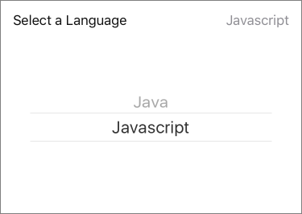

`InputPicker` (component)
=========================

On iOS we always want the input field to expand downwards
to reveal the picker. On Android, we want to render the
Picker in dialog form when touched.

Props
-----

### `editable`

type: `bool`
defaultValue: `true`


### `expanded`

controls whether the picker is visible. (iOS only) *

type: `bool`


### `label` (required)

the label for the picker *

type: `string`


### `onToggleExpansion` (required)

a function called when toggling the visibility of the picker. (iOS only) *

type: `func`


### `value`

the picker value displayed in the row. (iOS only) *

type: `string`



```javascript
import { InputPicker } from 'panza'
import {
  Picker
} from 'react-native'

<InputPicker
  expanded={this.state.focusPicker}
  value={this.state.language}
  label='Select a Language'
  editable={this.state.editable}
  onToggleExpansion={() => {
    this.setState({ focusPicker: !this.state.focusPicker })
  }}>
  <Picker
    prompt='Select a language'
    style={{ width: 300 }}
    selectedValue={this.state.language}
    onValueChange={(lang) => this.setState({ language: lang })}>
      <Picker.Item label='Java' value='Java' />
      <Picker.Item label='Javascript' value='Javascript' />
  </Picker>
</InputPicker>
```
